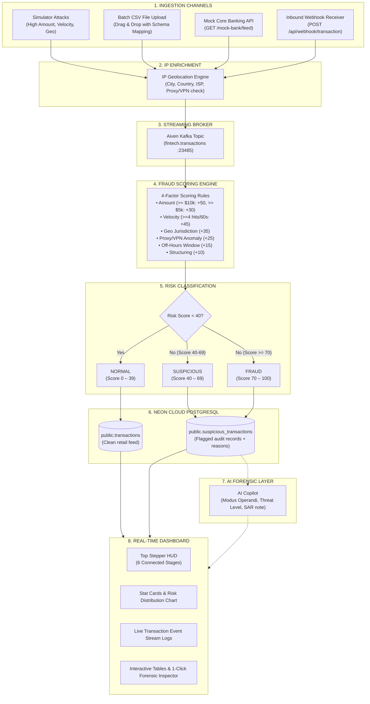

# FinShield — End-to-End System Data Flow & Architecture Document

This document explains the **step-by-step lifecycle of a financial transaction** in the FinShield platform, from the initial ingestion trigger to database persistence, AI forensic analysis, and real-time dashboard visualization.

---

## 1. High-Level System Flow Diagram



---

## 2. Step-by-Step Pipeline Walkthrough

### 🔹 Stage 1: Data Ingestion (4 Ingestion Sources)
Transactions enter the system through any of the following four channels:
1. **Interactive Attack Simulator**: Injects targeted threat patterns (`HIGH_AMOUNT`, `VELOCITY_SPIKE`, `FOREIGN_LOCATION`, `OFF_HOURS_SPIKE`, or `RANDOM`).
2. **Batch CSV Upload Engine**: Accepts `.csv` files, parses headers dynamically (`transaction_id`, `amount`, `merchant`, `location`, `ip_address`), and processes rows in batch with real-time UI feedback.
3. **Mock Core Banking API Server**: `GET /mock-bank/feed` generates batches of simulated enterprise core banking ledger movements.
4. **Public Webhook Receiver**: `POST /api/webhook/transaction` receives live JSON payloads from payment gateways (e.g., Stripe, Visa, Adyen).

---

### 🔹 Stage 2: IP Geolocation & Threat Enrichment
- The engine inspects the transaction's `ip_address`.
- Queries the IP Geolocation service (`app/ip_geo_service.py`) to resolve:
  - **Origin Country & City** (e.g., `Panama City, Panama`).
  - **ISP & Autonomous System** (e.g., `Hosting Provider`, `Tor Exit Node`, `Residential ISP`).
  - **Proxy / VPN / Datacenter Flag**: Detects whether the user is masking their true location.
- **In-Memory Caching**: Resolved IPs are cached in memory to maximize throughput.

---

### 🔹 Stage 3: Event Streaming (Aiven Kafka)
- The transaction payload is serialized into a standard JSON message.
- Published to the Aiven Kafka topic `fintech.transactions` via Aiven's secure HTTPS REST Proxy / SASL_SSL broker at port `23485`.
- Decouples transaction producers from downstream consumer analytics and ensures zero data loss.

---

### 🔹 Stage 4: 4-Factor Fraud Scoring Engine
The transaction is evaluated against 4 primary threat dimensions. Point weights accumulate to compute a **Risk Score (0–100)**:

$$\text{Risk Score} = \min(100, \sum \text{Rule Weights})$$

| Threat Vector | Condition | Weight | Example Rule Trigger |
| :--- | :--- | :---: | :--- |
| **Critical High Amount** | Amount $\ge \$10,000$ | **+50** | `Critical High Amount: $14,500.00 exceeds $10,000 threshold (+50)` |
| **Elevated High Amount** | Amount $\ge \$5,000$ | **+30** | `High Amount: $8,999.00 exceeds $5,000 threshold (+30)` |
| **High-Risk Category** | Amount $\ge \$2,500$ in Crypto/Casino/Wire | **+25** | `Elevated Amount in High-Risk Category (Cryptocurrency) (+25)` |
| **Velocity Burst** | $\ge 4$ txns in 60s for same account | **+45** | `High Velocity Spike: 4 transactions in 60 seconds (+45)` |
| **Velocity Anomaly** | 3 txns in 60s for same account | **+30** | `Velocity Anomaly: 3 transactions in 60 seconds (+30)` |
| **High-Risk Jurisdiction**| Originates in Cayman Islands, Panama, etc. | **+35** | `High-Risk Jurisdiction Detected: Cayman Islands (+35)` |
| **Proxy / VPN / Datacenter**| IP detected as Hosting / VPN / Tor | **+25** | `Proxy / VPN / Hosting Datacenter IP Detected (+25)` |
| **Impossible Travel** | Rapid location jump in $<120\text{s}$ | **+30** | `Impossible Travel: Location jump from NYC to Panama (+30)` |
| **Off-Hours Window** | Night activity between 01:00 AM – 04:30 AM | **+15** | `Off-Hours Activity: Night window (02:15 UTC) (+15)` |
| **Structuring Pattern** | Round or threshold-skirting amount | **+10** | `Structuring Pattern: Suspicious amount $9,999.00 (+10)` |

---

### 🔹 Stage 5: Risk Classification & Database Routing
The computed Risk Score classifies the transaction into one of 3 tiers and routes it to the **Neon PostgreSQL** database:

```
                  ┌─────────────────────────────────┐
                  │       Risk Score (0 - 100)      │
                  └────────────────┬────────────────┘
                                   │
         ┌─────────────────────────┼─────────────────────────┐
         │ (0 - 39)                │ (40 - 69)               │ (70 - 100)
         ▼                         ▼                         ▼
   [ NORMAL ]               [ SUSPICIOUS ]              [ FRAUD ]
   • Clean retail purchase  • Review required          • Critical threat
   • Stored in table:       • Stored in table:         • Stored in table:
     `transactions`           `suspicious_transactions`  `suspicious_transactions`
```

- **Database UPSERT**: If a transaction ID already exists upon re-upload or API sync, the engine performs an in-place update to prevent duplicate key errors.

---

### 🔹 Stage 6: AI Forensic Intelligence Layer
When a flagged incident is opened for audit:
- The backend compiles the transaction payload, triggered rules, and account history.
- The AI Engine evaluates:
  - **Threat Level**: `CRITICAL`, `HIGH`, `MEDIUM`, or `LOW`.
  - **Executive Summary**: Clear non-technical explanation of the incident.
  - **Modus Operandi**: Identifies the attack pattern (e.g., *Account Takeover*, *Card Testing*, *Structuring*).
  - **Recommended Action**: (e.g., *Freeze Card*, *Initiate Step-up MFA*, *Contact Cardholder*).
  - **SAR Compliance Note**: Ready-to-file regulatory guidance for FinCEN SAR reports.

---

### 🔹 Stage 7: Real-Time User Interface & Visualizer
The React frontend synchronizes with the backend via live polling:
1. **Top Pipeline Stepper & Inspector**: Pinned visual workflow tracker illuminating through all 6 stages (`Ingestion` $\rightarrow$ `IP Geo` $\rightarrow$ `Kafka` $\rightarrow$ `Rules` $\rightarrow$ `Neon DB` $\rightarrow$ `AI Copilot`) with latency metrics ($\sim 14\text{ms}$).
2. **Stat Cards**: Real-time counters for Total Volume, Normal passed, Suspicious flagged, Fraud blocked, and Average Risk Score.
3. **Live Transaction Event Stream Logs**: Terminal console logging every streaming transaction with search, filter, 1-click JSON copy, and JSON log export.
4. **Interactive Data Tables**: Split view displaying flagged fraud incidents alongside the normal retail stream.

---

## 3. Concrete Example Walkthroughs

### Example 1: Clean Retail Transaction (Normal)
1. **Payload**: User `USR-9901` buys groceries for `$48.50` at Whole Foods in New York, IP `192.168.1.5`.
2. **IP Geo**: Resolves as domestic US IP, no proxy detected.
3. **Scoring**:
   - Amount: $< \$5,000 \rightarrow 0$ pts
   - Velocity: 1st transaction $\rightarrow 0$ pts
   - Location: New York (Low risk) $\rightarrow 0$ pts
   - **Total Risk Score**: `0 / 100` $\rightarrow$ **`NORMAL`**
4. **Storage**: Saved to Neon DB `transactions` table.
5. **UI**: Displayed with green badge in the Live Normal Stream.

---

### Example 2: Suspicious Luxury Purchase (Fraud)
1. **Payload**: User `USR-9902` spends `$14,500.00` at Cartier Boutique, location listed as Cayman Islands, IP `185.220.101.4`.
2. **IP Geo**: Resolves IP in Cayman Islands, flagged as Datacenter / Anonymizing Proxy.
3. **Scoring**:
   - Critical High Amount: $\ge \$10,000 \rightarrow \mathbf{+50}$ pts
   - High-Risk Jurisdiction: Cayman Islands $\rightarrow \mathbf{+35}$ pts
   - Proxy / Datacenter IP: Detected $\rightarrow \mathbf{+25}$ pts
   - **Total Risk Score**: $\min(100, 50+35+25) = \mathbf{100 / 100} \rightarrow$ **`FRAUD`**
4. **Storage**: Saved to Neon DB `suspicious_transactions` table with reasons:
   `"Critical High Amount: $14,500 exceeds $10,000 threshold (+50); High-Risk Jurisdiction Detected (+35); Proxy/VPN IP Detected (+25)"`.
5. **UI**: Appears instantly in the **Flagged Fraud Table** and **Live Event Log Console**.
6. **AI Forensic Audit**: Classifies incident as **CRITICAL Threat Level**, Modus Operandi: *High-Value Offshore Card Cloning / Account Takeover*, Recommended Action: *Immediate card freeze & request cardholder confirmation*.

---

## 4. Summary Component Reference

| Layer | Component File | Role |
| :--- | :--- | :--- |
| **Ingestion** | `backend/app/routes/external_ingest.py` | CSV parsing, external API collector, webhook receiver |
| **Mock Bank** | `backend/app/routes/mock_bank.py` | Mock Core Banking feed generator and webhook simulator |
| **IP Intelligence** | `backend/app/ip_geo_service.py` | IP geolocation lookup, caching, proxy/VPN detection |
| **Scoring Engine** | `backend/app/fraud_detector.py` | 4-factor scoring, velocity memory, geo heuristics |
| **Streaming** | `backend/app/kafka_producer.py` | Aiven Kafka REST & SSL publisher |
| **Database** | `backend/app/database.py`, `models.py` | Neon PostgreSQL engine, tables, UPSERT handler |
| **AI Layer** | `backend/app/mistral_service.py` | Forensic reasoning, executive briefing generator |
| **Top Stepper** | `frontend/src/components/PipelineTerminalHUD.jsx` | 6-stage live workflow tracker & logs console |
| **Event Logs** | `frontend/src/components/LiveTransactionEventLog.jsx` | Searchable transaction stream log terminal |
| **CSV Modal** | `frontend/src/components/CsvUploadModal.jsx` | Drag-and-drop CSV upload with row-by-row audit |
| **API Modal** | `frontend/src/components/ExternalApiConnector.jsx` | Mock Bank & External API connection controls |
